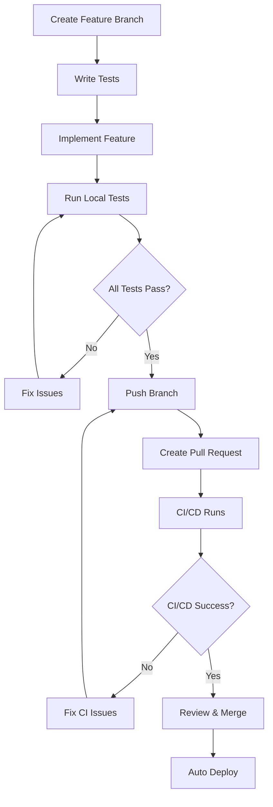

# 🤝 Contributing to Online DevToolsKit

¡Gracias por tu interés en contribuir a DevToolsKit! Esta guía te ayudará a entender cómo colaborar de manera efectiva siguiendo nuestras políticas de calidad y testing.

## 📋 Tabla de Contenidos

- [🚀 Inicio Rápido](#-inicio-rápido)
- [🔄 Workflow de Contribución](#-workflow-de-contribución)
- [🧪 Estrategia de Testing](#-estrategia-de-testing)
- [🛡️ Branch Protection](#️-branch-protection)
- [📝 Estándares de Código](#-estándares-de-código)
- [🛠️ Herramientas de Desarrollo](#️-herramientas-de-desarrollo)
- [🐛 Reportar Bugs](#-reportar-bugs)
- [💡 Sugerir Features](#-sugerir-features)

## 🚀 Inicio Rápido

### Prerequisitos
- **Node.js** >= 20.19.0
- **npm** >= 10.x
- **Git** configurado
- **Playwright** (se instala automáticamente)

### Setup del Proyecto
```bash
# 1. Fork el repositorio en GitHub
# 2. Clonar tu fork
git clone https://github.com/TU_USUARIO/devToolsKit.git
cd devToolsKit

# 3. Configurar remote upstream
git remote add upstream https://github.com/antoniogomezgallardo/devToolsKit.git

# 4. Instalar dependencias
npm install

# 5. Instalar navegadores de Playwright
npm run playwright:install

# 6. Verificar que todo funciona
npm run dev           # Servidor local
npm run test:run      # Unit tests
npm run test:e2e      # E2E tests
npm run type-check    # Verificar tipos
```

## 🔄 Workflow de Contribución

### ⚠️ **OBLIGATORIO: GitFlow + Pull Requests + Testing**

**🚨 IMPORTANTE**: Con branch protection activada, **TODAS las contribuciones DEBEN usar Pull Requests**. Los merges directos a `main` están **bloqueados**.

### 1️⃣ **Preparar tu Entorno**
```bash
# Sincronizar con upstream
git fetch upstream
git checkout develop
git merge upstream/develop
git push origin develop
```

### 2️⃣ **Crear Feature Branch**
```bash
# Crear rama desde develop (NUNCA desde main)
git checkout -b feature/nombre-descriptivo

# Ejemplos de nombres válidos:
# feature/base64-encoder
# feature/password-generator
# feature/improve-jwt-decoder
# hotfix/json-validator-bug
# fix/responsive-mobile-layout
```

### 3️⃣ **Desarrollar con TDD**
```bash
# 1. Escribir tests primero (TDD approach)
npm run test         # Unit tests en modo watch
npm run test:e2e:ui  # E2E tests con UI visual

# 2. Implementar funcionalidad
# 3. Verificar que todos los tests pasan
npm run test:run     # ✅ Unit tests
npm run test:e2e     # ✅ E2E tests  
npm run type-check   # ✅ TypeScript
npm run build        # ✅ Build check
```

### 4️⃣ **Commit Guidelines**
```bash
# Commits descriptivos en español
git add .
git commit -m "feat: implementar Base64 encoder/decoder

- Agregar componente Base64Tool con validación
- Implementar encoding/decoding seguro  
- Añadir tests unitarios y E2E completos
- Actualizar página principal con nueva herramienta
- Optimizar SEO con meta tags y structured data"

# Tipos de commit válidos:
# feat: nueva funcionalidad
# fix: corrección de bugs
# test: añadir o modificar tests
# refactor: refactoring sin cambios de funcionalidad
# docs: cambios en documentación
# style: cambios de formato, no de lógica
# perf: mejoras de performance
# build: cambios en build system
```

### 5️⃣ **Pull Request (OBLIGATORIO)**
```bash
# 1. Push de tu rama
git push origin feature/nombre-descriptivo

# 2. Crear Pull Request en GitHub:
#    Base: develop ← Compare: feature/nombre-descriptivo
#    
# 3. El PR DEBE incluir:
#    - Título descriptivo
#    - Descripción detallada con checklist
#    - Screenshots si incluye cambios visuales
#    - Lista de tests añadidos/modificados
```

### 6️⃣ **Template de Pull Request**
```markdown
## 📋 Descripción
Breve descripción de los cambios realizados.

## 🔄 Tipo de Cambio
- [ ] 🐛 Bug fix
- [ ] ✨ Nueva funcionalidad  
- [ ] 💥 Breaking change
- [ ] 📝 Actualización de documentación
- [ ] 🔧 Refactoring
- [ ] ⚡ Performance improvement

## ✅ Checklist Pre-merge (OBLIGATORIO)
### 🧪 Testing
- [ ] ✅ **Unit tests pasan** (`npm run test:run`)
- [ ] ✅ **E2E tests pasan** (`npm run test:e2e`)  
- [ ] ✅ **Coverage >80%** en todas las métricas
- [ ] 🧪 **Tests añadidos** para nueva funcionalidad
- [ ] 🎭 **E2E tests incluyen** todos los casos de uso

### 🔍 Code Quality  
- [ ] ✅ **Type check sin errores** (`npm run type-check`)
- [ ] ✅ **Build exitoso** (`npm run build`)
- [ ] 📝 **Documentación actualizada** si es necesario
- [ ] 🏗️ **Código sigue estándares** del proyecto

### 🎨 UI/UX
- [ ] 📱 **Responsive design** verificado
- [ ] ♿ **Accesibilidad** (ARIA labels, semantic HTML)
- [ ] 🎯 **Consistent design** con design system
- [ ] 🔄 **Loading states** implementados

### 🔍 SEO & Analytics
- [ ] 🏷️ **Meta tags** configurados
- [ ] 📊 **Analytics events** implementados
- [ ] 🔗 **Structured data** añadido
- [ ] 📈 **Performance optimizado**

## 🧪 Testing Detallado
### Unit Tests
- **Archivos**: `tests/unit/tools/[nombre]/*.test.ts`
- **Coverage**: Statement/Branch/Function/Lines >80%
- **Tests incluyen**:
  - [ ] Casos válidos
  - [ ] Casos inválidos/errores
  - [ ] Edge cases
  - [ ] Validaciones

### E2E Tests  
- **Archivos**: `tests/e2e/[nombre].spec.ts`
- **Navegadores**: Chrome, Firefox, Safari (desktop + mobile)
- **Tests incluyen**:
  - [ ] Flujo completo de usuario
  - [ ] Input/output validation
  - [ ] Copy functionality
  - [ ] Clear/reset functionality
  - [ ] Error handling
  - [ ] Responsive behavior

## 📸 Screenshots (si aplica)
[Adjuntar capturas de pantalla]

### Desktop


### Mobile  


## 🎯 Testing Instructions
Cómo probar manualmente esta feature:

1. **Setup**: `npm run dev`
2. **Navigate**: Ir a `/tools/[nombre-herramienta]`  
3. **Test Cases**:
   - Input válido: [describir]
   - Input inválido: [describir]
   - Edge cases: [describir]
4. **Expected Results**: [describir comportamiento esperado]

## 📝 Notas Adicionales
[Cualquier información adicional]

## 🔗 Issues Relacionados
Fixes #[número] - [descripción del issue]
```

## 🧪 Estrategia de Testing

### **🚨 OBLIGATORIO: Tests deben pasar antes de merge**

Tenemos **branch protection** configurada que **BLOQUEA** merges si:
- ❌ Unit tests fallan
- ❌ E2E tests fallan  
- ❌ Type check falla
- ❌ Build falla

### 🎯 Testing Architecture

**No necesitamos integration tests** porque:
- ✅ **Client-side only**: No APIs complejas
- ✅ **Herramientas independientes**: No dependencias entre tools
- ✅ **Simple data flow**: Input → Processing → Output
- ✅ **E2E tests cubren** flujos completos de usuario

### Unit Tests (Vitest)
```bash
# Comandos disponibles
npm run test         # Modo watch
npm run test:run     # Una ejecución
npm run test:coverage # Con coverage report
npm run test:ui      # UI visual para tests
```

**Coverage mínimo requerido:**
- **Statements**: >80%
- **Branches**: >80%  
- **Functions**: >80%
- **Lines**: >80%

**Configuración**: `vitest.config.ts`
- **Environment**: jsdom (simula browser)
- **Setup**: `tests/setup.ts`
- **Coverage**: c8 provider con reportes HTML

### E2E Tests (Playwright)
```bash
# Comandos disponibles  
npm run playwright:install  # Instalar navegadores
npm run test:e2e            # Todos los navegadores
npm run test:e2e:ui         # Con interfaz visual
npm run test:e2e:headed     # Con navegador visible
```

**Navegadores testados:**
- ✅ **Chrome Desktop** - Chromium engine
- ✅ **Firefox Desktop** - Gecko engine  
- ✅ **Safari Desktop** - WebKit engine
- ✅ **Chrome Mobile** - Pixel 5 simulation
- ✅ **Safari Mobile** - iPhone 12 simulation

**Configuración**: `playwright.config.ts`
- **Base URL**: `http://localhost:1234`  
- **Auto start**: Server de desarrollo automático
- **Parallel**: Tests en paralelo para velocidad
- **Reports**: HTML, JSON, JUnit para CI/CD

### 📝 Testing Guidelines por Herramienta

Cada nueva herramienta **DEBE incluir**:

#### Unit Tests Template
```typescript
// tests/unit/tools/nueva-herramienta/utils.test.ts
import { describe, test, expect } from 'vitest';
import { validateInput, processData } from '../../../../src/tools/nueva-herramienta/utils';

describe('Nueva Herramienta Utils', () => {
  describe('validateInput', () => {
    test('should validate correct input', () => {
      const result = validateInput('valid-input');
      expect(result).toBe(true);
    });
    
    test('should reject invalid input', () => {
      const result = validateInput('');
      expect(result).toBe(false);
    });
    
    test('should handle edge cases', () => {
      // Test edge cases específicos
    });
  });
  
  describe('processData', () => {
    test('should process data correctly', () => {
      const result = processData('input-data');
      expect(result).toBe('expected-output');
    });
    
    test('should handle errors gracefully', () => {
      expect(() => processData(null)).toThrow('Expected error');
    });
  });
});
```

#### E2E Tests Template  
```typescript
// tests/e2e/nueva-herramienta.spec.ts
import { test, expect } from '@playwright/test';

test.describe('Nueva Herramienta Tool', () => {
  test.beforeEach(async ({ page }) => {
    await page.goto('/tools/nueva-herramienta');
  });

  test('should process valid input', async ({ page }) => {
    // Test caso de uso principal
    await page.getByPlaceholder('Input placeholder...').fill('valid-input');
    await expect(page.getByText('Success message')).toBeVisible();
    
    // Verificar output
    const output = page.getByPlaceholder('Output placeholder...');
    await expect(output).toContainText('expected-content');
  });

  test('should handle invalid input', async ({ page }) => {
    // Test manejo de errores
    await page.getByPlaceholder('Input placeholder...').fill('invalid-input');
    await expect(page.getByText('Error message')).toBeVisible();
  });

  test('should copy result to clipboard', async ({ page }) => {
    // Test funcionalidad copy
    await page.getByPlaceholder('Input placeholder...').fill('valid-input');
    await page.getByRole('button', { name: 'Copiar' }).click();
    await expect(page.getByText('¡Copiado!')).toBeVisible();
  });

  test('should clear all fields', async ({ page }) => {
    // Test funcionalidad clear
    await page.getByPlaceholder('Input placeholder...').fill('test-input');
    await page.getByRole('button', { name: 'Limpiar' }).click();
    
    await expect(page.getByPlaceholder('Input placeholder...')).toHaveValue('');
    await expect(page.getByPlaceholder('Output placeholder...')).toHaveValue('');
  });

  test('should work on mobile', async ({ page, isMobile }) => {
    if (!isMobile) return;
    
    // Test responsive behavior
    await expect(page.getByRole('heading')).toBeVisible();
    // ... mobile-specific tests
  });
});
```

## 🛡️ Branch Protection

### Configuración Actual

**Protected Branches:**
- ✅ `main` - **BLOQUEADA** para push directo
- ✅ Require PR reviews antes de merge
- ✅ Require status checks (CI/CD)
- ✅ Require branches to be up to date

**Required Status Checks:**
- ✅ **Unit Tests** (`🧪 Unit Tests`)
- ✅ **E2E Tests** (`🎭 E2E Tests`)  
- ✅ **Type Check** (`🔍 Type Check`)
- ✅ **Build Check** (`🏗️ Build`)

### Workflow Enforcement



### Commands para Verificar Localmente
```bash
# ANTES de crear PR, ejecutar TODOS estos comandos:
npm run test:run      # ✅ Unit tests
npm run test:e2e      # ✅ E2E tests
npm run type-check    # ✅ TypeScript
npm run build         # ✅ Build check

# Si ALGUNO falla, el PR será RECHAZADO automáticamente
```

## 📝 Estándares de Código

### TypeScript Standards
```typescript
// ✅ Bien - Interfaces explícitas
interface ToolConfig {
  id: string;
  name: string;
  description: string;
  category: ToolCategory;
}

// ✅ Bien - Tipos explícitos en funciones
const validateInput = (input: string): ValidationResult => {
  // Implementation
};

// ❌ Mal - Uso de `any`
const processData = (data: any): any => {
  return data;
};

// ✅ Bien - Error handling tipado
type ProcessResult = 
  | { success: true; data: string }
  | { success: false; error: string };
```

### Component Structure
```typescript
// Estructura estándar de herramienta
export class MiHerramienta {
  private container: HTMLElement;
  private config: ToolConfig;
  
  constructor(container: HTMLElement, config: ToolConfig) {
    this.container = container;
    this.config = config;
    this.init();
  }
  
  private init(): void {
    this.render();
    this.setupEventListeners();
    this.setupAnalytics();
  }
  
  private render(): void {
    // HTML generation with Tailwind
  }
  
  private setupEventListeners(): void {
    // Event handlers
  }
  
  private setupAnalytics(): void {
    // Analytics tracking
  }
  
  private processInput(input: string): ProcessResult {
    // Core business logic
  }
}
```

### CSS/Tailwind Guidelines
```html
<!-- ✅ Bien: Classes organizadas por categoría -->
<div class="
  flex items-center justify-center
  w-full h-48
  p-4 m-2
  bg-white border border-gray-200
  rounded-lg shadow-md
  hover:shadow-lg
  focus:outline-none focus:ring-2 focus:ring-blue-500
  transition-all duration-200
">

<!-- ❌ Mal: Classes mezcladas sin orden -->
<div class="bg-white flex p-4 shadow-md rounded-lg w-full justify-center border items-center h-48">
```

### File Organization
```
src/tools/nueva-herramienta/
├── index.ts              # Exportar tool
├── NuevaHerramienta.ts   # Main component  
├── utils.ts              # Business logic
├── types.ts              # TypeScript types
└── constants.ts          # Tool-specific constants

tests/
├── unit/tools/nueva-herramienta/
│   ├── utils.test.ts     # Unit tests for utils
│   └── component.test.ts # Unit tests for component
└── e2e/
    └── nueva-herramienta.spec.ts # E2E tests
```

## 🛠️ Herramientas de Desarrollo

### Scripts Esenciales
```bash
# Desarrollo
npm run dev              # Servidor local con hot reload

# Testing  
npm run test             # Unit tests en modo watch
npm run test:run         # Unit tests una vez
npm run test:coverage    # Coverage report
npm run test:ui          # Visual test UI
npm run test:e2e         # E2E tests
npm run test:e2e:ui      # E2E con interfaz visual
npm run test:e2e:headed  # E2E con navegador visible

# Quality checks
npm run type-check       # TypeScript verification
npm run build           # Production build
npm run preview         # Preview production build

# Playwright
npm run playwright:install # Install browsers
```

### Ejecutar Tests E2E Específicos
```bash
# Un archivo específico
npx playwright test homepage.spec.ts
npx playwright test json-validator.spec.ts
npx playwright test jwt-decoder.spec.ts

# Test específico por nombre
npx playwright test --grep "should load successfully"
npx playwright test --grep "SEO meta tags"

# Con interfaz visual (RECOMENDADO para desarrollo)
npx playwright test --ui
npx playwright test json-validator.spec.ts --ui

# Para debugging (navegador visible)
npx playwright test homepage.spec.ts --headed
npx playwright test --grep "JWT" --debug

# Con timeout personalizado
npx playwright test homepage.spec.ts --timeout=10000

# Ver último reporte
npx playwright show-report
```

### Development Flow
```bash
# 1. Start development
npm run dev &            # Background server
npm run test &           # Background unit tests

# 2. Visual E2E testing during development  
npm run test:e2e:ui      # Interactive E2E testing

# 3. Pre-commit verification
npm run test:run && npm run test:e2e && npm run type-check && npm run build
```

### Debugging Tools
- **DevTools**: Chrome DevTools para debugging
- **VS Code Extensions**:
  - Playwright Test for VSCode
  - Vitest Runner  
  - TypeScript Hero
  - Tailwind CSS IntelliSense
- **Test Debugging**: 
  - `test.only()` para tests específicos
  - `page.pause()` en E2E para debugging
  - `console.log` en unit tests (remover antes de commit)

## 🐛 Reportar Bugs

### Template de Bug Report
```markdown
## 🐛 Descripción del Bug
Descripción clara y concisa del problema.

## 🔄 Pasos para Reproducir
1. Ir a 'X página'
2. Hacer click en 'Y botón'
3. Introducir 'Z valor'
4. Ver error

## ✅ Comportamiento Esperado
Descripción clara de lo que se esperaba que pasara.

## ❌ Comportamiento Actual  
Descripción clara de lo que pasa actualmente.

## 📱 Entorno
- **OS**: [ej. macOS 13.0, Windows 11]
- **Navegador**: [ej. Chrome 118, Firefox 119]
- **Dispositivo**: [ej. iPhone 14, Desktop]
- **Resolución**: [ej. 1920x1080, 375x667]

## 📸 Screenshots
[Adjuntar capturas de pantalla del problema]

## 🧪 Tests Relevantes
¿Hay algún test que capture este bug?
- [ ] Sí - Test name: `test-name`
- [ ] No - Este bug no está cubierto por tests

## 🔍 Log de Errores
```javascript
// Pegar errores de console aquí
Error: Something went wrong...
```

## 🎯 Impacto
- [ ] 🔴 Crítico - Bloquea funcionalidad principal
- [ ] 🟡 Alto - Afecta experiencia de usuario
- [ ] 🟢 Medio - Problema menor
- [ ] 🔵 Bajo - Mejora cosmética
```

## 💡 Sugerir Features

### Criterios de Evaluación
1. **🎯 Demanda de usuarios**: ¿Los developers lo necesitan?
2. **🔍 SEO Potential**: ¿La gente busca esto en Google?
3. **⚡ Feasibilidad técnica**: ¿Se puede hacer client-side?
4. **📊 Valor único**: ¿Ya existe en otras herramientas?
5. **💰 Monetization**: ¿Puede generar tráfico/revenue?

### Template de Feature Request
```markdown
## 💡 Descripción de la Feature
Descripción clara y detallada de la funcionalidad propuesta.

## 🎯 Problema que Resuelve
¿Qué problema específico resuelve esta feature para los developers?

## 💭 Solución Propuesta
Describe cómo crees que debería funcionar:

### Input
- Formato: [ej. JSON, XML, Base64]
- Validaciones: [ej. required fields]

### Processing  
- Algoritmo: [ej. encoding, parsing, validation]
- Edge cases: [ej. large files, special characters]

### Output
- Formato: [ej. formatted JSON, converted XML]
- Features: [ej. copy to clipboard, download]

## 📋 Criterios de Aceptación
- [ ] Input validation funciona correctamente
- [ ] Processing maneja todos los casos de uso
- [ ] Output se formatea correctamente
- [ ] Error handling es robusto
- [ ] UI es responsive
- [ ] Performance es aceptable para archivos grandes

## 🔍 Palabras Clave SEO
Lista de términos que la gente buscaría:
- "herramienta X online"  
- "convertir Y a Z"
- "validar A online"

## 🎨 Mockups/Referencias
[Enlaces a herramientas similares o mockups]

## 🧪 Strategy de Testing
¿Cómo testearías esta feature?

### Unit Tests
- [ ] Validation logic
- [ ] Processing functions
- [ ] Error handling

### E2E Tests  
- [ ] Complete user flow
- [ ] Edge cases
- [ ] Mobile responsiveness

## 📊 Prioridad Sugerida
- [ ] 🔴 Alta - Feature muy demandada
- [ ] 🟡 Media - Nice to have
- [ ] 🟢 Baja - Futuro

**Justificación**: [Por qué esta prioridad]

## 🚀 Implementación
¿Te gustaría implementar esta feature?
- [ ] Sí, puedo implementarla
- [ ] Sí, pero necesito ayuda con [X]
- [ ] No, solo sugiero la idea
```

## 🏆 Contributors & Recognition

### Contribution Levels
- **🥉 Bronze**: 1-3 PRs merged exitosos
- **🥈 Silver**: 4-9 PRs merged + 1 herramienta completa
- **🥇 Gold**: 10+ PRs + múltiples herramientas + mentoring
- **💎 Diamond**: Core maintainer + architectural decisions

### Recognition System
- **📝 Credits**: En cada herramienta implementada
- **🏆 Hall of Fame**: README.md contributors section
- **🎯 Special mentions**: En releases importantes
- **💰 Revenue sharing**: Para contributors principales (futuro)

### Quality Metrics para Recognition
- ✅ **Test coverage** >80% en contribuciones
- ✅ **Zero regression** policy - no romper features existentes  
- ✅ **Documentation** completa en PRs
- ✅ **Code review** participation activa

## 📞 Soporte y Comunicación

### Channels Disponibles
- **🐛 GitHub Issues**: Bugs y feature requests
- **💬 GitHub Discussions**: Preguntas generales y arquitectura
- **📧 Email**: [Por definir para casos especiales]

### Response Time Goals
- **🔴 Bugs críticos**: <24 horas
- **🟡 Feature requests**: <72 horas  
- **🟢 General questions**: <1 semana
- **🔵 Code reviews**: <48 horas

### Quality Standards para Communication
- **🇪🇸 Español**: Idioma principal del proyecto
- **🎯 Specific**: Issues específicos con ejemplos
- **📝 Documented**: Referencias a líneas de código
- **🧪 Testable**: Casos de uso reproducibles

---

## 🚨 Recordatorios Críticos

### ⛔ **NUNCA hacer esto:**
1. **Merge directo a `main`** - Está **BLOQUEADO**
2. **Push code sin tests** - CI/CD **RECHAZARÁ** el PR
3. **Ignorar type errors** - Build **FALLARÁ**
4. **Skip E2E tests** para nuevas features - **OBLIGATORIO**
5. **Commit secrets** - Revisar antes de push

### ✅ **SIEMPRE hacer esto:**
1. **Pull Request workflow** para TODA contribución  
2. **Tests completos** (unit + E2E) antes de PR
3. **Local verification** con todos los scripts
4. **Documentation** actualizada si es necesario
5. **Responsive design** verificado en mobile

### 🎯 **Testing es NO-NEGOCIABLE:**
- **Coverage >80%** requerido
- **E2E tests** para todos los user flows
- **CI/CD debe pasar** completamente
- **No exceptions** - sin tests, sin merge

---

¡Gracias por contribuir a hacer DevToolsKit la mejor herramienta para desarrolladores! 🚀

Tu contribución debe ser **tested**, **documented**, y **accessible**. Quality over speed! 💎